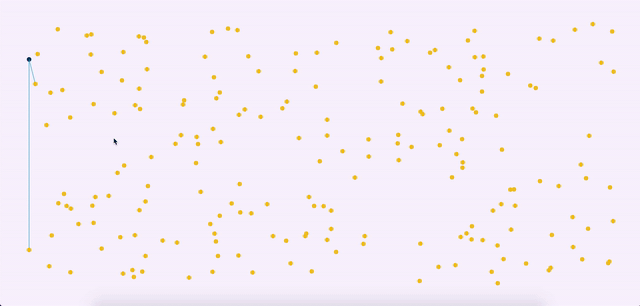
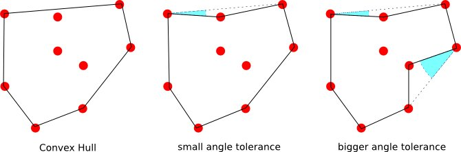

# Convex Hull Algorithms(Gift Wrapping)

# Description

This repository is a description and visualization of the Gift Wrapping Algorithm which helps to find Convex Hull in the given points. Let's get started:

-   [Demo](#demo)
-   [What is Convex Hull?](#What-is-Convex-Hull?)
-   [What is Gift Wrapping Algorithm?](#What-is-Gift-Wrapping-Algorithm)
-   [Thanks for your attention](#Thanks-for-your-attention)

# Demo

This repository has all codes which I have used in the demo. You are welcome to pull this repository and explore or edit it. Additionally, If you want to see the live demo you can use the following link:

https://vusalis.github.io/Convex-Hull-Algorithms/

# What is Convex Hull?

In the given a set of points, the convex hull of the set is the smallest convex polygon that contains all the points of it. This mathematical term has so many [applications](https://en.wikipedia.org/wiki/Convex_hull#Applications). As you see in the below picture, the first polygon is convex hull because none of the angles is greater than 180 degrees(Those points are marked as black).

# What is Gift Wrapping Algorithm?

To find a convex hull, there are a lot of different algorithms(Gift Wrapping, Graham Scan, etc.). Today we will talk about the Gift Wrapping approach. This algorithm is the simplest way to find the convex hull, and the complexity of the algorithm is n\*h(In our example, complexity is 54). n represents the number of points in our set, h represents the number of convex points(which we create a line to make convex hull). If you look at the above picture carefully, you will see that left most, rightmost, topmost, and bottom-most points are always convex points. For finding the start point, we can choose one of them, but as a convention, we will choose left most point. After choosing the first point, we compare all other points and trying to find which point is located on the leftmost side from the chosen point. Furthermore, the next leftmost point will be our current point, and we will compare all other points with that point. We recursively repeat this process till finding our starting point. Logical sequence as following:

1. Initialize p as leftmost point.
1. Make it current point.
1. Do following while we do not come back to the first (or leftmost) point.
    . Find left most point compare to current point.
    1. Make new left most point current point and draw a line.
    1. When current value is equal to initial value stop.

# Thanks for your attention

Thanks for your attention! See you 👋
